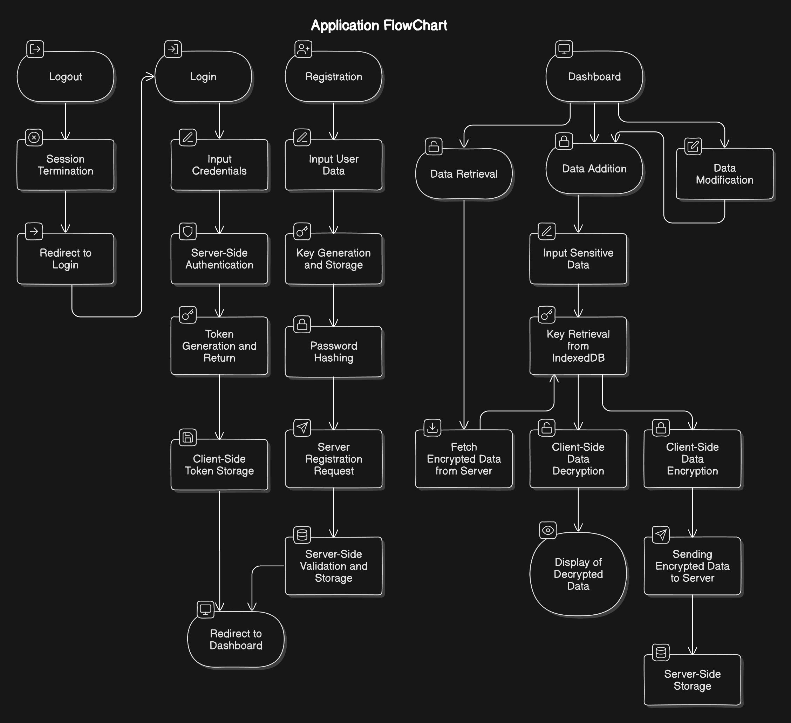

# SecureVault

SecureVault is a secure web application designed for storing sensitive information, such as card details, with robust end-to-end security. With AES-256 encryption and client-side data handling, SecureVault ensures that only the user has access to their encrypted data. The app emphasizes user privacy, performing encryption and decryption entirely on the client side, so data remains private even on the server.

## Features
- **Secure Storage**: Sensitive information, such as card details, is stored securely using AES-256 encryption.
- **Client-Side Encryption & Decryption**: All data is encrypted before leaving the client and decrypted upon retrieval, ensuring full privacy.
- **IndexedDB Key Storage**: Encryption keys are generated during registration and stored securely in the user's browser's IndexedDB, never accessible by the server.
- **User Authentication**: Provides secure login, registration, and session management with token-based authentication.
- **Responsive UI**: Designed for usability across desktops, tablets, and mobile devices.

## Tech Stack
- **Frontend**: React, Tailwind CSS, Flowbite UI
- **Backend**: Node.js, Express, MongoDB
- **Encryption**: AES-256 using the Web Cryptography API
- **Client-Side Key Storage**: IndexedDB for secure key management
- **State Management**: Recoil for handling global state

## Application Flow

### User Registration
1. **Input User Data**: User registers with an email and password.
2. **Key Generation**: A unique encryption key is generated on the client side and stored in IndexedDB.
3. **Password Hashing**: Password is hashed before storage.
4. **Server Registration**: The server validates and stores the hashed credentials.
5. **Redirect to Login**: Upon success, the user is directed to the login page.

### Login Process
1. **Input Credentials**: User logs in with email and password.
2. **Server Authentication**: Backend validates credentials and, if successful, generates an authentication token.
3. **Token Storage**: Token is stored client-side to manage session.
4. **Dashboard Access**: User is redirected to their dashboard upon successful login.

### Encryption Process (Data Addition)
1. **Data Input**: User inputs sensitive information.
2. **Key Retrieval**: The encryption key is fetched from IndexedDB.
3. **Client-Side Encryption**: Data is encrypted with AES-256 on the client side.
4. **Storage**: Encrypted data is sent to the server and securely stored in MongoDB.

### Decryption Process (Data Retrieval)
1. **Data Fetch**: Encrypted data is retrieved from the server.
2. **Key Retrieval**: Encryption key is fetched from IndexedDB.
3. **Client-Side Decryption**: Data is decrypted client-side.
4. **Display**: Decrypted data is displayed securely on the dashboard.

### Dashboard Access and Data Management
- **Access to Dashboard**: After login, the dashboard displays decrypted data for user access.
- **Data Retrieval**: Encrypted data is fetched, decrypted, and displayed.
- **Data Editing**: Decrypted data can be edited, re-encrypted, and saved.
- **Data Addition**: New data can be added and encrypted as described in the encryption process.

### Logout Process
1. **Session End**: User logs out, clearing the session token from client storage.
2. **Redirect**: User is redirected to the login page for secure logout.

## Future Enhancements
- **Two-Factor Authentication (2FA)**: Add an extra layer of security to user authentication.
- **Multiple Device Support**: Ensure a seamless experience across desktops, tablets, and mobile devices.
